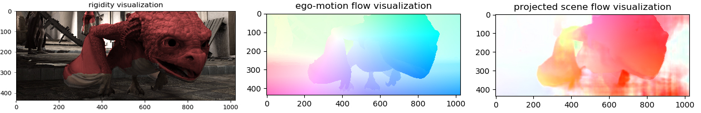

# Learning Rigidity in Dynamic Scenes with a Moving Camera for 3D Motion Field Estimation (ECCV 2018)


### License ###
Copyright (c) 2018 NVIDIA Corp.  All Rights Reserved.
This work is licensed under the [Creative Commons Attribution NonCommercial ShareAlike 4.0 License](https://creativecommons.org/licenses/by-nc-sa/4.0/legalcode).

### Project page ###
[NVIDIA Research project page](http://research.nvidia.com/publication/2018-09_Learning-Rigidity-in)

### Paper ###
 * [ArXiv](https://arxiv.org/pdf/1804.04259.pdf)  
 * [Video (Youtube)](https://www.youtube.com/watch?v=MnTHkOCY790)

### Project members ###

* [Zhaoyang Lv](https://www.cc.gatech.edu/~zlv30/), Georgia Institute of Technology
* [Kihwan Kim](http://research.nvidia.com/person/kihwan-kim), NVIDIA
* [Alejandro Troccoli](http://research.nvidia.com/person/alejandro-troccoli), NVIDIA
* [Deqing Sun](http://research.nvidia.com/person/deqing-sun), NVIDIA
* [James M. Rehg](https://rehg.org/), Georgia Institute of Technology
* [Jan Kautz](http://research.nvidia.com/person/jan-kautz), NVIDIA

## Usage
We provide both Docker-based setup for the containerizaiton and generic setup with conda.

## 1. Running with Docker
### Prerequisites  
* Install [nvidia-docker](https://github.com/nvidia/nvidia-docker/wiki/Installation-(version-2.0)).
* Clone [gtsam](https://bitbucket.org/gtborg/gtsam/src/develop/) at **'external_packages/'** folder (do not build it there yet. Docker will build inside the container later).
#### Pretrained model for default inference  
  Download the following models and put them in the **'weights/'** directory.  
   * [Rigidity Transform Network Weights][1]: trained on our REFRESH dataset,   
   * [PWC-net Weights][2]: sequentially trained on FlyingChairs and FlyingThings3D, which is the same weights from [PWC-Net Pytorch][3] repository


### Build with Docker

```
docker build . --tag rigidity:1.0
```
Now go to the **root folder** of this project, and run the run_container.sh script. This is important as we will mount the project folder inside the docker container.

```
sudo ./run_container.sh
```
 
### Run the inference code

Run the example inference code with default weights with the refinement step and visualization flags:

```
/rigidity#python run_inference.py --post_refine --visualize
```  

Then the output of the testing example (using an example pair from sintel's market_5) will pop up as shown below:  
  

You can also check out the **'results/'** folder to see all saved images.  
Optionally you can specify the output folder with ``--output_path``. See more options with ``--h``.

The estimated pose from the refinment will be shown as:
```
Estimated two-view transform
[[[ 0.99974869  0.01963792 -0.01081263 -0.04639582]
  [-0.01937608  0.9995287   0.02381045 -0.05028503]
  [ 0.01127512 -0.02359496  0.99965802  0.44513745]
  [ 0.          0.          0.          1.        ]]]
```


You can manually choose the network weights if you have another models.

```
/rigidity$python run_inference.py --pwc_weights weights/pwc_net_chairs.pth.tar --rigidity_weights weights/rigidity_net.pth.tar --post_refine --visualize

# to check the help functions
/rigidity$python run_inference.py --help
```

### Run the training code

Training code will be available soon.


## 2. Running with conda

The code was developed using Python 2.7 & PyTorch 0.3.1 & Cuda 8.0. We provide an anaconda environment with all dependencies needed.
To run it, please ensure you have the [Anaconda Python 2.7 version](https://www.anaconda.com/download/#linux) installed and set the environment path for **conda**. Then run the following script to automatially set up the environment:
```
sh setup/install_for_network.sh
# If you don't need the refinement stage, you can choose not to run this. 
# And set the post_refine flag to be false
sh setup/install_for_refinement.sh
```

### Run the inference code

Download the following pre-trained models and put them in the **'weights/'** directory:

* [Rigidity Transform Network Weights][1]: trained on our REFRESH dataset
* [PWC-net Weights][2]: sequentially trained on FlyingChairs and FlyingThings3D, which is the same weights from [PWC-Net Pytorch][3] repository

Please refer to the issue list of [PWC-net/pytorch](https://github.com/NVlabs/PWC-Net/tree/master/PyTorch) if there is any issue w.r.t. the flow models. 

Run the example inference code with default weights the refinement step and visualization:

```
python run_inference.py --post_refine --visualize
```

Or you can manually choose the network weights 

```
python run_inference.py --pwc_weights weights/pwc_net_chairs.pth.tar --rigidity_weights weights/rigidity_net.pth.tar --post_refine --visualize

# to check the help functions
python run_inference.py --help
```

To run results for your own inputs, you can use the default simple loader provided in the **run_inference.py** example. You need to set the color images directory, depth images directory (only support *'.dpt'* and *'.png'* format), and a simple pin-hole camera intrinsic parameters ('fx,fy,cx,cy'). For example: 

```
python run_inference.py --color_dir data/market_5/clean --depth_dir data/market_5/depth --intrinsic 1120,1120,511.5,217.5 --post_refine --visualize
```

### Run the training code

We are working on a release version of it. Will be available soon.

### Dataset ###
* [Document for SINTEL used for this work][4]
* [REFRESH Data][5]

[1]: https://drive.google.com/open?id=1FkCKnAFuzPa_ndwK01zGaXnL9xKgN2LY
[2]: https://drive.google.com/open?id=1bgcRJKGM0KRREUFjHWeMWQTMsm3sFFZw
[3]: https://github.com/NVlabs/PWC-Net/tree/master/PyTorch
[4]: #
[5]: #